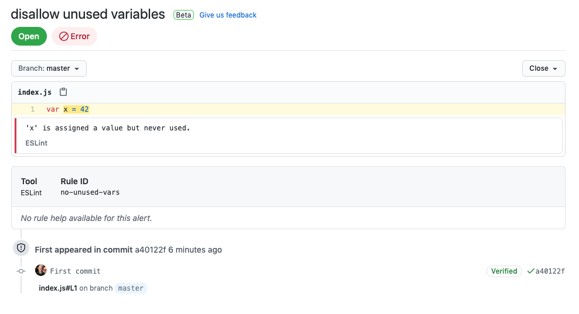

# `code-scanning-playground`
> :wave: :earth_americas: a playground for **Code Scanning** :roller_coaster:

## Contents
- [About](#about)
- [How it works](#how-it-works)
- [Getting started](#getting-started)
- [Additional resources](#additional-resources)

## About
This is a template repo, demonstrating GitHub's [Code Scanning capability](https://docs.github.com/en/github/finding-security-vulnerabilities-and-errors-in-your-code/about-code-scanning), using ESLint to generate a "code scanning alert" in GitHub's Security tab:

## How it works
- The ESLint analysis workflow [runs on a schedule, and on every `push`](https://github.com/swinton/code-scanning-playground/blob/20366008d4376dd1899559fba0bf5fbbece109c3/.github/workflows/upload-sarif.yml#L3-L8)
- The ESLint output is [formatted as SARIF](https://github.com/swinton/code-scanning-playground/blob/20366008d4376dd1899559fba0bf5fbbece109c3/.github/workflows/upload-sarif.yml#L18-L20), using the [`@microsoft/eslint-formatter-sarif`](https://github.com/microsoft/sarif-sdk/tree/master/src/ESLint.Formatter#readme) package
- The SARIF report is submitted to GitHub via the [`github/codeql-action/upload-sarif`](https://github.com/github/codeql-action/tree/main/upload-sarif) action

## Getting started
1. Register for the code scanning beta [here](https://github.com/features/security/advanced-security/signup)
1. [Generate a copy of this repo](https://github.com/swinton/code-scanning-playground/generate)
1. Push a commit -- it can even be an empty commit (`git commit --allow-empty`)
1. Observe as a new security alert is generated

## Additional resources
- [SARIF example output](example.sarif.json)
- [SARIF specification](https://docs.oasis-open.org/sarif/sarif/v2.1.0/sarif-v2.1.0.html)
- [`microsoft/sarif-tutorials`](https://github.com/microsoft/sarif-tutorials): User-friendly documentation for the SARIF file format
- [SARIF Validator](https://sarifweb.azurewebsites.net/Validation): View and validate your SARIF files
- [`Sarif.Multitool`](https://www.nuget.org/packages/Sarif.Multitool/): Multi-purpose command line tool for analyzing and manipulating SARIF files
- [JSON schema for the SARIF specification](https://docs.oasis-open.org/sarif/sarif/v2.1.0/cos02/schemas/sarif-schema-2.1.0.json)
- [`ajv-validator/ajv-cli`](https://github.com/ajv-validator/ajv-cli): Command line interface for [`ajv`](https://github.com/epoberezkin/ajv), one of the [fastest json schema validators](https://github.com/ebdrup/json-schema-benchmark)
- [SARIF support for code scanning](https://docs.github.com/en/github/finding-security-vulnerabilities-and-errors-in-your-code/sarif-support-for-code-scanning)
- [Example workflow that runs the ESLint analysis tool](https://docs.github.com/en/github/finding-security-vulnerabilities-and-errors-in-your-code/uploading-a-sarif-file-to-github#example-workflow-that-runs-the-eslint-analysis-tool)
- REST API: https://docs.github.com/en/rest/reference/code-scanning
- Demo app for uploading SARIF reports to GitHub via the REST API as a GitHub App: https://github.com/swinton/github-app-upload-sarif
